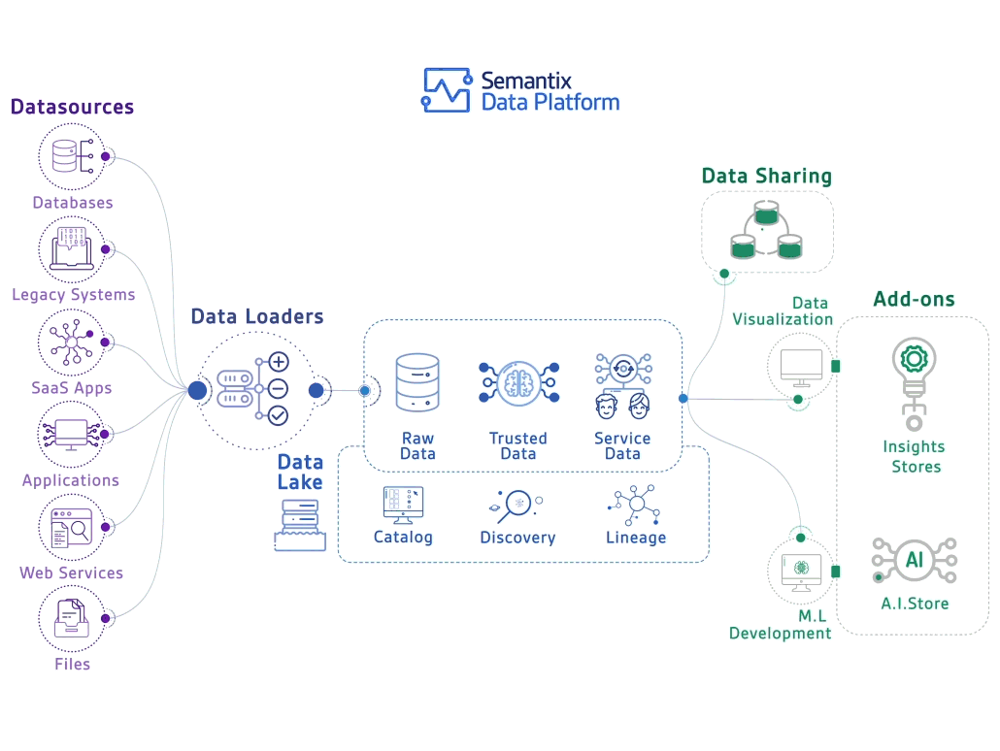
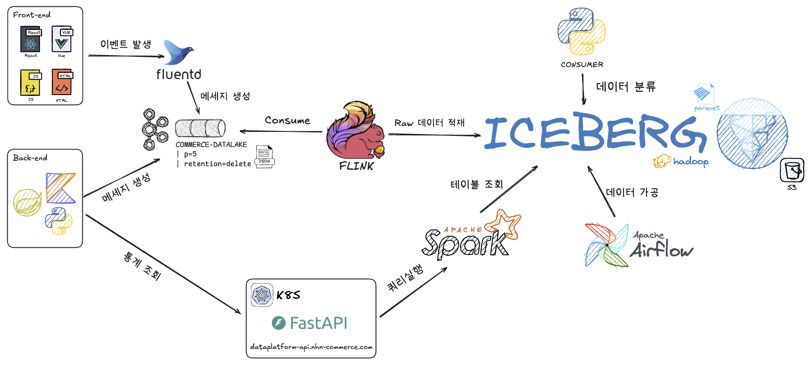
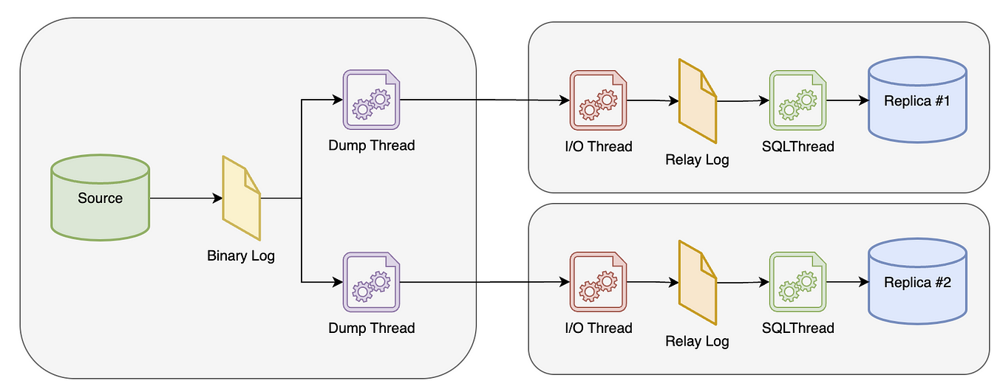

# 아키텍처

## 데이터 플랫폼 아키텍처

**데이터 레이크 흐름도**

- Data Loaders = Kafka
- Data Lake = Iceberg
- Data Stream Processing = Apache Flink
- Data Pipeline = Apache Airflow
- Data Serving = Fast API
- Data Mart = Nosql, Mysql 기타 등등

## MySQL Log Directory Full 장애

INSERT : 데이터 이전과 같이 많은 양의 데이터 삽입시 바이너리 로그 파일의 수가 급증함
UPDATE, DELETE : 많은 양의 데이터를 한번에 변경하면 바이너리 로그 파일의 사이즈가 급증함

바이너리 로그 파일은 지정된 주기에 따라 자동으로 삭제되지만 사용중인 파일은 삭제할 수 없음

수백만건의 상품 마이그레이션 작업 후 Log Directory Full 발생하여 DB 복제 지연 및 Main DB Latency 영향

## Mysql 8.0 Strict Mode 장애
https://nhnent.dooray.com/wiki/2328769003387573566/3759675871134632037
