# 코루틴 이란?

`2022.4월` 샵바이 개발팀 공유

- Co + Routine
  - Co : 협력
  - Routine : 함수
- 즉 서로 협력하는 함수
  - 협력한다 라는 의미는 함수의 블록이 끝나지 않아도 중간에 빠져나와 다른 함수들과 협력할수있다 라는 의미 (아래 예시에서 설명)
- 비 선점 멀티태스킹 (자세한 설명은 아래 예시3.2 에서 자세히 설명)
- 경량 스레드
  - **하나의 스레드**안에서 실행하기 때문에 **context Switching**이 발생하지않음
- 일반적인 함수는 종료될때까지 함수 블럭을 못벗어나지만 코루틴은 일시중단하고 블럭을 벗어나 다른 작업을 **비동기적**으로 수행

<br>


⇒ <span style="color:#e11d21">**같은 scope** </span>내에서 비동기적인 실행 (= caller)
코드로 예시를 들면

```kotlin
@Test
fun `코루틴`() {
    runBlocking {
    	launch {
            delay(1000L)
            println("World!")
        }
        println("Hello,")
    }
}
```

```
//결과
Hello, World!
```

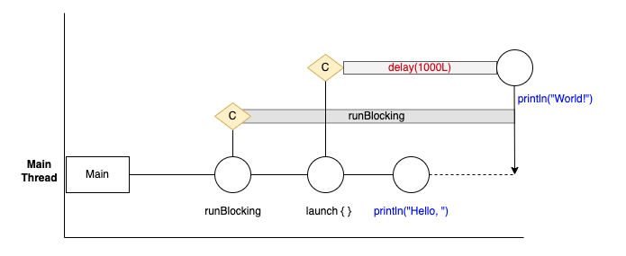
<br>

#### 코루틴은 중간에 빠져나올수있는 <span style="color:#e11d21">협력 함수</span>이다.

- runBlocking : 코루틴 Scope은 만들고 내부의 코드가 다 동작할때까지 해당 thread를 blocking
- `runBlocking` 으로 감싸여진 `launch{}` 와 `println("Hello, ")` 는 같은 scope에 있다.
- `launch`로 생성된 코루틴은 비동기 실행이 가능
  - `launch`가 실행되고 내부에서`delay(1000L)`가 걸리면 코루틴이므로 해당 블록을 빠져나와 `println("Hello, ")`를 실행한다.
  - 이후 1000ms 가 지나면 `println("World!"`) 를 실행한다.

-> 코루틴인 `launch{}` 는 블록이 종료가 되지않아도 같은 스코프 내에서 다른것들과 **협력**한다!

## 코루틴의 구성 요소

**코루틴은 기본적으로 세가지로 구성되어있다.**

- coroutineScope
- coroutineContext
- Builder

### CoroutineScope

- `CoroutineScope`, `GlobalScope` , ..
- 말 그대로 코루틴의 범위이다.
- 같은 scope 내의 코루틴들이 비동기적으로 동작한다.
- 코루틴은 코루틴 스코프안에서만 동작한다.

### CoroutineContext

- `Dispatcher.IO`, `Dispatcher.Main`, `Dispatcher.Default`, ...
- 코루틴을 실행하는 특정 환경
- 주요 요소는 `job`과 `Dispatcher`
  - job : 코루틴을 제어하기위한것 (코루틴의 시작, 종료, 합치기 등등)
  - Dispatcher : 코루틴과 스레드의 연관을 제어
- Dispatcher를 코루틴이 동작하는 Thread 나 Thread Pool 이라 이해했다.
  - ( Dispatcher 에 대한 자세한 설명은 아래에서 할 예정 )

### CoroutineBuilder

- `async`, `launch`, `runBlocking`
- 코루틴 빌더는 스코프에서 실행할 코루틴을 **생성하는 역할**이다.
  - `CoroutineScope`에서 코루틴이 생성되어야만 비동기적인 동작을 한다.
  - scope를 생성했어도 builder를 통해 **코루틴을 생성하지않았다면 비동기적인 동작은 하지않는다.**

#### (1) launch

- 결과 반환이 없는 단순 작업, Job 리턴

#### (2) Async

- 결과 반환이 필요한 작업, Deferred\<T> 반환
  - Deferred는 미래에 올수있는 값을 담아놓는 객체
  - Deferred 의 ` await()` 메서드가 수행되면 코루틴의 결과가 반환되기까지 기다림
  - 이것을 코루틴이 일시중단 되었다고 함

#### (3) runBlocking

- 코루틴 빌더 이지만 앞의 두개와는 조금 다름
- 새로운 코루틴을 생성하고, 생성된 코루틴이 완료될때까지 **현재 스레드를 차단**한다.
- 메인 함수나 테스트 함수에서 사용할것을 권장한다. (일반 함수에서는 suspend를 호출하기위한 용도)
- 중요한 점은 ` runBlocking`은 **현재의 스레드를 점유**한다라는것이다.

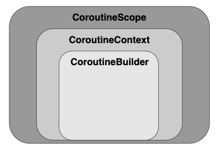

- 세 구성요소의 포함관계는 그림과 같다.
- 위의 이미지 처럼 builder를 사용할때는 scope와 context를 명시해야한다.
  - `CoroutineScope(Dispatchers.IO).launch { }`  이런식으로 사용
  - 하지만 이미 생성된 scope 내에서는 `launch { }` 이렇게 더 많이 사용한다.
    - 명시를 하지않으면 현재의 context와 scope를 이어받기때문

세가지 기본 구성에 추가로 `dispatcher`와 `suspend fun`, `withContext`에 대해 설명

#### Dispatcher

- coroutineContext의 일부
- 코루틴 실행시 사용할<span style="color:#e11d21"> **스레드**</span>를 제어하는 역할

종류는 기본적으로 네가지가 있다.

#### `Dispatcher.Default`

- **IO dispatcher와 스레드 풀을 공유한다.**
  - 백그라운드 스레드에서 작동
- 크기는 기본값으로 CPU 코어 수 만큼 스레드를 생성한다. (최소 2개)
- **CPU 작업을 필요로하는 무거운 작업에 적합**
  - 그 이유는 코어수 만큼 스레드를 생성하기때문에 CPU를 많이 점유하는 작업에서 최대 효율을 낸다
- 내 컴퓨터 코어수 확인

```bash
sysctl -n hw.ncpu
# 결과
8
```

- 아래의 코드로 default 스레드풀의 스레드를 출력하면 코어개수와 동일한것을 볼수있다.
  - `repeat(50) {CoroutineScope(Dispatchers.Default).launch {         println(Thread.currentThread().name)     }}`

#### `Dispatcher.IO`

- **Default Dispatcher와 스레드풀을 공유**
- 필요에 따라 스레드를 더 생성하거나 줄일수 있다. (최대 64개)
- 이름에 맞게 주로 **DB, 네트워크, 파일 관련 작업에 적합**
- 위의 방법과 동일하게 thread를 출력해보면 **core의 개수보다 많은것**을 확인할수있다.
  - 그 이유는 대기시간이 긴 네트워크 작업의 경우 **더 많은 스레드를 이용해 병렬처리**하는것이 더 효율적이기 때문이다.

#### <span style="color:#0052cc">프로젝트에 적용시에는 기본적으로 제공하는 Dispatcher를 사용하기보다 각 기능에 맞는 Dispatcher를 생성해 사용하는것이 좋다.</span>

예시)

**<span style="color:#0052cc"> 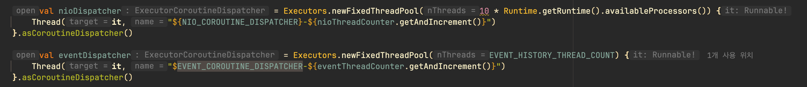 </span>**

#### suspend fun

- 일시 중단이 가능한 함수
  - 원하는 지점에서 중단후, 나중에 다시 실행을 진행할 수 있다.
- suspend 함수는 무조건 중단 되는게 아닌 **중단점을 만나야 중단**이 된다. (ex. delay(), WebClient 통신시..)
- suspend fun 만으로는 비동기 처리가 안됨.
  - suspend fun은 코루틴 내부에 있어야하고, 그 코루틴은 해당 스코프에서 비동기 처리를함
  - 비동기에서 중요한점은 **해당 스코프에서 코루틴을 생성**해야한다는 것이다.
- coroutine의 suspend 함수는 thread를 block 하지않는다.

<br>
헷갈렸던 부분을 예시로 들어보면
<br>
``` kotlin
@Test
fun `동기`() {
    runBlocking {
            val time = measureTimeMillis {
                val one = first()
                println("between")
                val two = second()
                println("the answer is ${one + two}")
            }
            println("Completed in $time ms")
    }
}
suspend fun first(): Int {
    println("first")
    delay(1000L)
    println("first end")
    return 13
}
suspend fun second(): Int {
    println("second")
    delay(1000L)
    println("second end")
    return 29
}
```

**나의 착각**

- 처음에는 위 예시를 실행하면 first()와 second()가 비동기 처리되어 결과가 1초가 나올줄알았다.
  - 그렇게 생각한 이유는 당시에는 코루틴(`runBlocking`)에서 ` suspend fun` 을 호출하므로 비동기적으로 실행될것으로 착각했다.
  - 하지만 해당 코드에서 코루틴은 전체를 감싸는 `runBlocking` 밖에 없다.
    - 비동기적으로 실행 되려면 <b><span style="color:#e11d21">같은 스코프에 명령어들과 코루틴</span></b>이 있어야한다.
    - 그러므로 delay 만큼 기다리고 아래의 코드를 순차적으로 진행하게 된다.
- 위의 코드는 그냥 순차적으로 출력된다.

### **실제 결과**

```
first
first end
between
second
second end
the answer is 42
Completed in 2021 ms //비동기 처리 안됨
```

#### <span style="color:#0052cc">**first() 나 second()를 비동기 방식인 WebClient를 사용하는 suspend fun 이라고 가정한다면** </span>

**<span style="color:#0052cc">코루틴을 생성하지않고 위와같은 방식으로 사용시 비동기 동작이 안된다는것을 알수있다. </span>**

### **비동기 코드로 변경**

- 위에서 설명했다시피 비동기를 이용하기위해서는 **같은 스코프에서 코루틴을 생성 했을 때 비동기 실행**을 한다.
  - 그러기 위해서는 first() 와 second()를 각각 `async`로 묶는다.
- 아래 코드를 보면 runBlocking 이 만든 스코프에 `async { first() }`, `println("between")`, `async { second() }` 가 있고
  - `aync` 로 만들어진 **코루틴은 협력하는 함수** 이므로 특정 시점(delay)에 일시정지를 하고 코루틴을 빠져나와 **같은 스코프의 다른 함수들과 협력**할수있다.

```kotlin
@Test
fun `비동기`() {
    runBlocking {
        val time = System.currentTimeMillis()
        val one = async { first() }
        println("between")
        val two = async { second() }
        println("the answer is ${one.await() + two.await()}")

        println("Completed in ${System.currentTimeMillis() - time} ms")
    }
}

suspend fun first(): Int {
    println("first")
    delay(1000L)
    println("first end")
    return 13
}
suspend fun second(): Int {
    println("second")
    delay(1000L)
    println("second end")
    return 29
}
```

```
between
first
second
first end
second end
the answer is 42
Completed in 1018 ms // 비동기 처리
```

그림으로 나타내보면 아래와 같다.
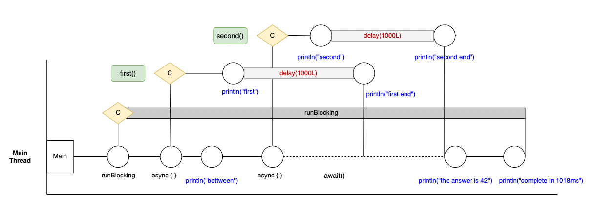

- 출력 결과는 그림의 파란색 글씨 순서대로 출력된다.
- 마름모는 코루틴이 생성되었다는것을 의미
- 코틀린은 총 runBlocking, async, async 총 세개가 생성됨
- first()와 second() 는 각각 async로 만든 코루틴 내부에 생기기 때문에 비동기 처리가 가능하다.
  - `println("first")` 보다 `println("between")` 이 먼저 출력된것은 **async를 call** 하기 때문이다.
- 비동기 처리로 인해 소요시간은 1000ms를 조금 넘는다.

#### 6) withContext

- 코루틴 빌더가 아니기때문에 코루틴을 생성하지않음
- suspend fun 이기때문에 코루틴, suspend fun 내부에서 사용되어야함
- `withContext`는 블록의 마지막 줄 값을 반환한다.
- `withContext`의 블록이 끝나기전까지 해당 코루틴은 일시정지
  - **순차적으로 코드가 실행되는것을 구현**할 수 있다.
- 코루틴의 실행환경을 **다른 컨텍스트로 전환**하는 역할
  - 코루틴이 실행되는 스레드를 변경한다 라고 이해하면된다.
  - `coroutineScope`와의 차이점은 `withContext`는 컨텍스트를 전달할수있다.
    - `coroutineScope ≡ withContext(this.coroutineContext)`

## 사용 사례

주문 도메인에서 사용하고 있는`transactionTemplate.executeWithContext {}`를 살펴보자
이것은 `withContext`이므로 코루틴 빌더가 아니다. (처음엔 이것도 코루틴 빌더라 착각했다.)
트랜잭션을 만들고 그 동작을 설정한 context에서 한다 라는 의미이다.

실제로 구현된 코드를 보면
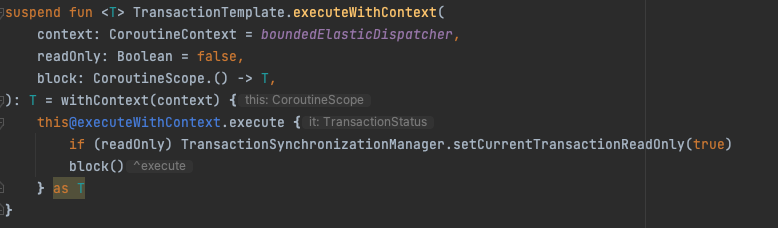

- withContext 선언 후 `execute` 하는 것을 볼수있다.
- context는 `boundedElasticDispatcher`를 사용
  - boundedElasticDispatcher는 Shedulers의 boundedElastic을 코루틴에서 사용하기위해 변환한 디스패처이다.
  - 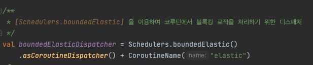
- boundedElastic()
  - 블로킹 IO 태스크와 같은 생명주기가 긴 태스크에 적합하다.
  - 제한된 수의 worker를 동적으로 생성하여 worker를 재사용하는 스케줄러이다.

## 예시

공부할 당시 코루틴에대해 확실히 이해하기 어려웠는데 아래 자료를 많이 참고함
[https://silica.io/understanding-kotlin-coroutines/5/](https://silica.io/understanding-kotlin-coroutines/5/)

### 싱글 스레드에서의 비동기 실행

처음 코루틴을 공부할때 **코루틴**과 **멀티 스레드**에대한 개념이 섞여 코루틴을 이해하기가 더 어려웠습니다.
코루틴을 이해하기 위해 먼저 멀티 스레드가 아닌 단일 스레드에서 진행하면서 코루틴을 이해하고 이후 예시에서 멀티 스레드를 다루겠습니다.

(현재 스레드 의 출력하는 부분은 코드상 생fㅑㄱ)
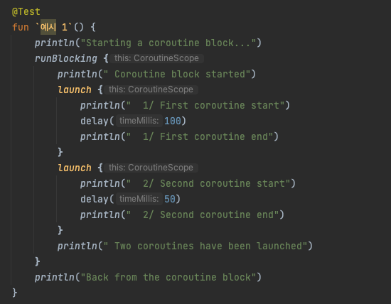

- 결과값을 보면 아래와 같은 순서로 출력됩니다.

```
[Test worker]                Starting a coroutine block...    // [Thread 종류 @코루틴번호] 출력,
[Test worker @coroutine#1]   Coroutine block started          // 현재는 싱글 스레드에서 실행하므로 test worker에서만 실행
[Test worker @coroutine#1]   Two coroutines have been launched
[Test worker @coroutine#2]    1/ First coroutine start
[Test worker @coroutine#3]    2/ Second coroutine start
[Test worker @coroutine#3]    2/ Second coroutine end
[Test worker @coroutine#2]    1/ First coroutine end
[Test worker]                Back from the coroutine block
```

<br>
###### **<span style="color:#0052cc">"Two coroutine have been launched" 가 "1/  Firsit \~" 와 "2/ Second \~" 보다 왜 먼저 출력될까요?</span>**
<br>


- 이전 코루틴 개념에서 설명했던것과 동일
- launch로 코루틴을 생성하고 바로 내부를 들어가는게 아닌 `launch`를 call을 한다.
  - 그렇기때문에 가장 마지막에있던 `println("Two coroutines have been launched")` 가 먼저 실행된것
- 코루틴의 동시성은 **같은 스코프**끼리 비동기적으로 동작한다. (너무 많이 반복하는것같지만 가장 중요하다 생각)

## 2) 비선점 멀티테스킹

- 코루틴의 동시성은 **비선점** 방식이다.
  - <span style="color:#000000">선점 :  기존의 Task가 실행중에 있어도 스케줄러가 강제 중지하고 다른 Task를 실행할수있음</span>
  - <span style="color:#000000">비선점 : 기존의 Task가 종료될때까지 계속 실행을 보장한다. </span>
- 하나의 작업이 스레드를 Blocking 하면 비선점 방식이므로 제어권을 가져올수없음
- 코루틴은 **동시성**은 제공하지만 **병렬성**은 제공하지않는다.
  - 코루틴은 하나의 스레드에서 동작하기때문이다.

### **(추가) 동시성 vs 병렬성**

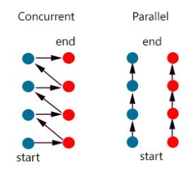

- 동시성 : 싱글 코어에서 멀티 스레드를 번갈아가며 동작하는 방식, 동시에 실행되는것 같이 보인다.
  - 동시성을 지원하는 경우, 하나의 코어에서 여러 스레드를 변경해가며 실행하므로  context switching 발생
- 병렬성 : 멀티 코어에서 멀티스레드를 동작하는 방식, 실제로 동시에 실행이됨

**코드 예시**
    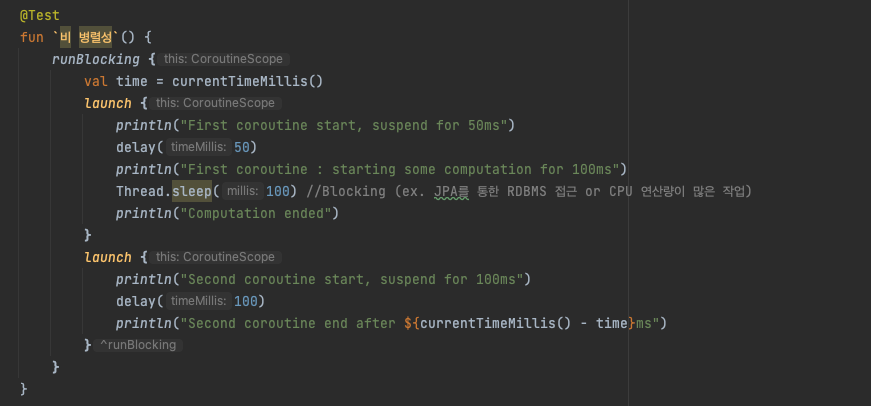
**결과**

```
First coroutine start, suspend for 50ms
Second coroutine start, suspend for 100ms
First coroutine : starting some computation for 100ms
Computation ended
Second coroutine end after 160ms // 100ms 가 아닌 160ms 가 소요됨
```


- 코루틴이 **비선점형 멀티태스킹**이라는것을 보여주는 예시
- 첫번째 코루틴에서 `Thread.sleep(100)` 으로 스레드를 독점함 (delay와 달리 thread가 blocking된다.)
  - 원래 두번째 코루틴은 100ms 만 delay 해야하지만 스레드 자체가 blocking 되어 실제로 150ms 가 걸림
- **즉 코루틴에 Blocking 작업은 비효율적이다.**
- 단일 스레드에서 코루틴은 `Webclient` 같은 **non-Blocking 작업에 효과**적이지만,  **Blocking 방식의 RDBMS** 작업은 효과적이지 않다 라는 결론.

#### **<span style="color:#0052cc">"그렇다면 우리는 Blocking 방식으로 동작하는 RDBMS(JPA)나 FeignClient 등을 사용할때는 코루틴 사용을 하면 안될까?"</span>**

> 멀티 스레딩 방식의 코루틴을 사용 해야한다.

### 멀티 스레딩

- **코루틴의 동시성**과 **멀티 스레딩**의 개념이 섞여서 어려웠다.
- 싱글 스레드 에서의 코루틴 동시성과 헷갈리면 안된다.
- 코루틴에서는 다른 스레드로 이동하는것이 굉장히 쉬움
- 위의 개념설명에서 보았던 `Dispatcher`를 이용하면 스레드를 변경할수있다.

**코드 예시**
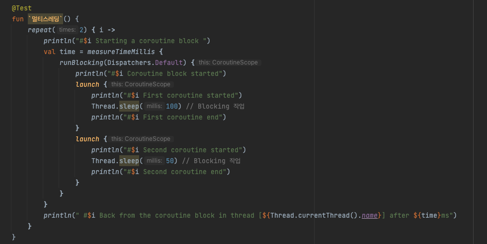

- `Dispatchers.Default` :  Default worker 스레드풀을 사용한다.
  - 이전에는 Test 코드의 메인 스레드인 `Test worker`만을 사용해 단일 스레드로 비동기 처리를 했음

```
================== 첫번째 ==================
[Test worker]                                 #0 Starting a coroutine block
[DefaultDispatcher-worker-1 @coroutine#1]     #0 Coroutine block started
[DefaultDispatcher-worker-2 @coroutine#2]     #0 First coroutine started
[DefaultDispatcher-worker-3 @coroutine#3]     #0 Second coroutine started
[DefaultDispatcher-worker-3 @coroutine#3]     #0 Second coroutine end
[DefaultDispatcher-worker-2 @coroutine#2]     #0 First coroutine end
[Test worker]                                 #0 Back from the coroutine block in thread [Test worker] after 133ms // 150ms 보다 작음
================== 두번째 ==================
[Test worker]                                 #1 Starting a coroutine block
[DefaultDispatcher-worker-2 @coroutine#4]     #1 Coroutine block started
[DefaultDispatcher-worker-2 @coroutine#6]     #1 Second coroutine started
[DefaultDispatcher-worker-1 @coroutine#5]     #1 First coroutine started
[DefaultDispatcher-worker-2 @coroutine#6]     #1 Second coroutine end
[DefaultDispatcher-worker-1 @coroutine#5]     #1 First coroutine end
[Test worker]                                 #1 Back from the coroutine block in thread [Test worker] after 106ms // 150ms 보다 작음
```

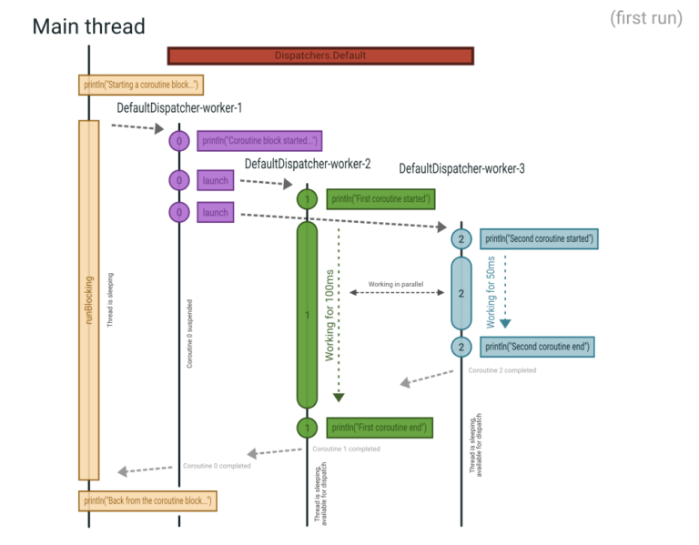

- `Thread.sleep`을 총 100 + 50 = 150ms 를 했지만 실제 결과들은 그것보다 짧음
  - 그 이유는 `DefaultDispatcher`를 이용해 다른 스레드들(worker-2, worker-3)에서 각각 100ms, 50ms 작업을 했기때문이다.
- 같은 작업을 했지만 첫번째(133ms) 보다 두번째(106ms) 가 더 빠른 이유는 첫번째 때 `defaultDispatcher-worker` 라는 스레드들을 생성해야하기때문이다.
  - 두번째는 이러한 스레드 생성이라는 오버헤드 없이 빠르게 작업가능
- 주의 해야할점은 **여러 스레드에서 동작을 시키므로 동시성 문제**를 신경써야한다.
  - 코루틴은 **동시성문제에 대해서는 보장하지않음**

## 컨텍스트 스위칭

- 멀티스레드의 동시성 문제 : 여러 스레드가 동시에 동일한 리소스에 접근할때 생기는 문제
  - 해결법은 모든 리소스를 **단일 스레드에서만 접근**할 수 있게한다.

**코드 예제**
**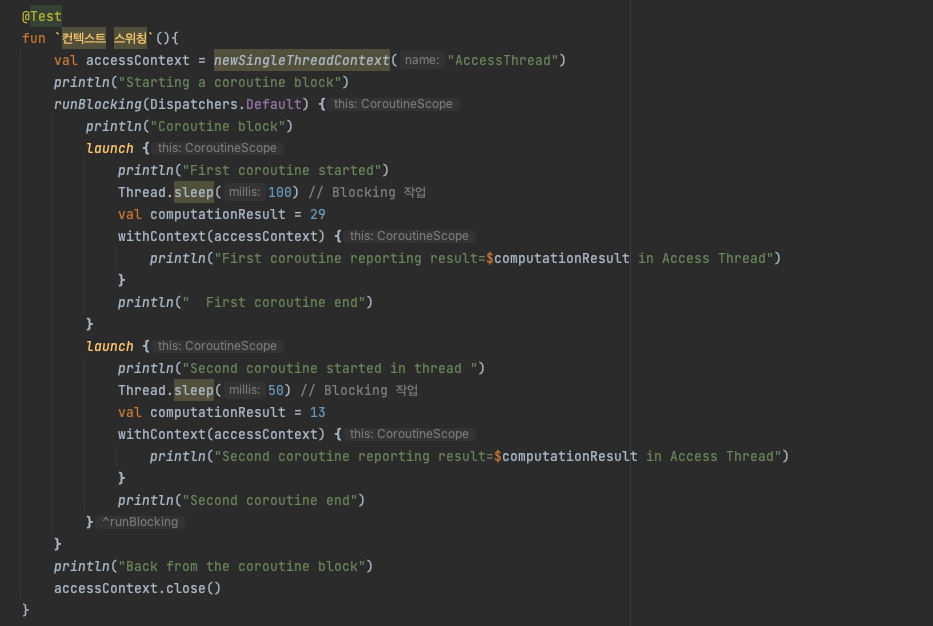**
**결과**

```
[Test worker]                               Starting a coroutine block
[DefaultDispatcher-worker-1 @coroutine#1]   Coroutine block

[DefaultDispatcher-worker-2 @coroutine#2]   First coroutine started
[DefaultDispatcher-worker-3 @coroutine#3]   Second coroutine started in thread
[DefaultDispatcher-worker-3 @coroutine#3]   Second coroutine end
[AccessThread @coroutine#4]                 Second coroutine reporting result=13 in Access Thread
[DefaultDispatcher-worker-2 @coroutine#2]   First coroutine end
[AccessThread @coroutine#5]                 First coroutine reporting result=29 in Access Thread

[Test worker]                               Back from the coroutine block
```


- `accessContext` 라는 하나의 스레드에서 리소스에 접근한다.
- 새로운 스레드를 생성하려면 `newSingleThreadContext()` 만 사용하면된다.
- 만약 "First coroutine end" 보다 "First coroutine reporting reulst = \~ " 를 더 빨리 출력하기 원하면 `withContext`를 사용하면 된다.
  - withContext는 **순차적인 실행을 보장**한다.
  - `launch(accessContext)` => `withContext(accessContext)`
  - 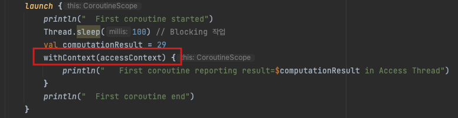

## 헷갈리는 개념

### runBlocking과 coroutinScope의 차이

- [https://www.baeldung.com/kotlin/coroutines-runblocking-coroutinescope](https://www.baeldung.com/kotlin/coroutines-runblocking-coroutinescope)
- 요약
  - **coroutineScope**
    - 일시중단 가능
    - 코루틴 범위 밖에서 호출 불가능
    - launch로 job을 반환 받아 코루틴 취소가 가능
  - **runBlocking**
    - 일시중단 불가능
    - 현재 스레드 차단
    - 메인메소드, 테스트 코드 와같이 기존 코루틴 범위 외부에서 코루틴 시작시 사용
    - launch로 job을 반환 받아도 코루틴 취소가 안된다.

### CoroutineScope와 coroutinScope 차이

- [https://stackoverflow.com/questions/59368838/difference-between-coroutinescope-and-coroutinescope-in-kotlin](https://stackoverflow.com/questions/59368838/difference-between-coroutinescope-and-coroutinescope-in-kotlin)
- [https://kotlinlang.org/api/kotlinx.coroutines/kotlinx-coroutines-core/kotlinx.coroutines/coroutine-scope.html](https://kotlinlang.org/api/kotlinx.coroutines/kotlinx-coroutines-core/kotlinx.coroutines/coroutine-scope.html)
- 요약
  - scope를 새롭게 만들지 아니면 이전의 scope에 이어서 구조적으로 사용하냐의 차이

## 마무리

- DB 통신이던 network 통신이던 한 scope에서 여러번 호출이 필요하다면 코루틴을 통한 비동기 통신은 효과적
- JPA는 **Blocking 방식**이므로 dispatcher를 이용해 멀티스레딩 방식으로 사용
  - 단 멀티스레딩에대한 **동시성 문제**는 신경써야함
