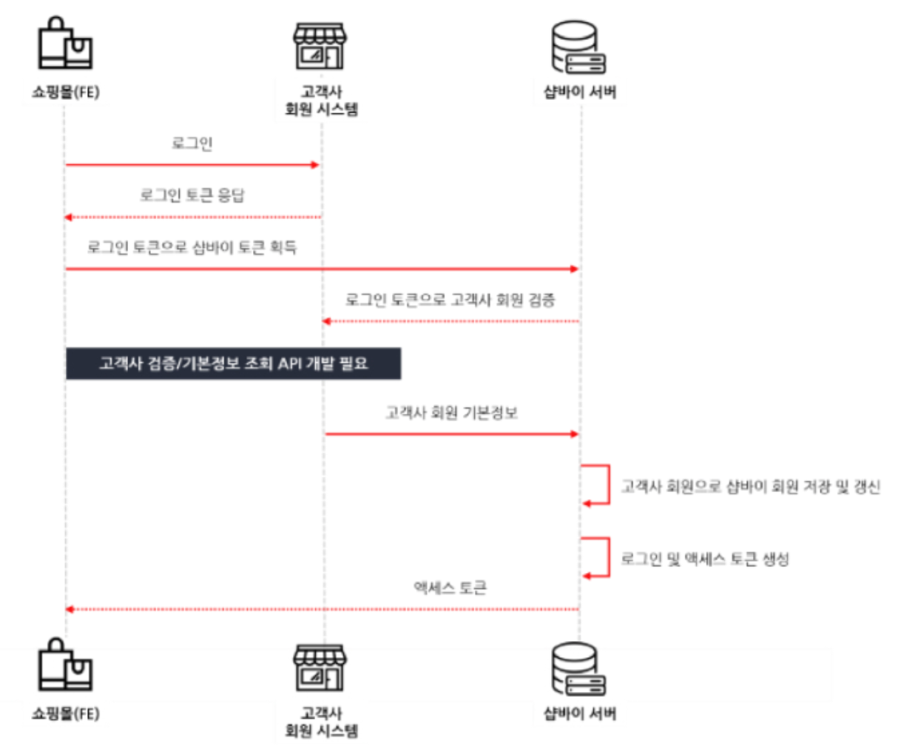

# 🔧 ThreadPool을 커스텀하게 분리한 이유

기존에는 `Dispatchers.IO`를 활용해 IO 작업을 처리하고 있었으나, 다음과 같은 문제가 발생하면서 **ThreadPool을 용도별로 커스텀하여 분리**하는 방향으로 개선

---

## ⚠️ 문제 1: 타임 이벤트 시 API 호출 폭주로 인한 서버 지연

### 📌 상황

- 이벤트 발생 시 **API 호출이 급격히 증가**하면서 서버 응답이 느려지는 현상이 발생
- 슬로우 쿼리나 명확한 장애 원인이 로그에 나타나지 않음

### 🔍 추정 원인

- 모든 IO 작업을 `Dispatchers.IO`에 위임
- 요청이 많아지면서 **가용 가능한 모든 IO 스레드가 점유**
- 그 결과, **신규 요청이 큐에 쌓이며 병목 발생**

### 🛠️ 조치

- ThreadPool을 역할별로 분리하여 관리
  - openFeign 호출용
  - Master DB
  - Slave DB
  - event 처리용
  - 일반적인 내부 IO 작업용 등

---

## ⚠️ 문제 2: 로그인 지연 및 ReadTimeout 발생

### 📌 상황

- 전체 쇼핑몰 중 40% 쇼핑몰은 **외부 회원 연동**을 통해 로그인 처리
- 나머지 쇼핑몰은 **내부 DB**를 통해 로그인 처리
- 이벤트 트래픽으로 인해 외부 회원 연동 요청이 대거 유입



### 🔍 문제점

- 외부 API가 응답을 늦게 반환함
- `Dispatchers.IO` 스레드가 모두 외부 API 응답 대기로 점유됨
- 내부 DB 로그인 요청조차 대기 상태로 밀림 → 결국 **ReadTimeout 발생**

### 🛠️ 조치

- 로그인 처리용 ThreadPool을 **용도별로 분리**:
  - 외부 연동 로그인용 ThreadPool
  - 내부 DB 로그인용 ThreadPool
- 이렇게 분리함으로써 **한쪽 처리 지연이 다른 쪽에 영향을 주지 않도록 격리**

---

## as-is

```kt
suspend fun createPartner(request: ServerRequest): ServerResponse = withContext(CommerceDispatchers.IO) {
        val mallNo = request.extractSystemInfo().mallNo
        val ip = request.extractIp()
        val command = request.awaitBodyOrThrow<PartnerCreateRequest>().also {
            validator.validateOrThrow(it)
            it.settlementConfig?.validate()
        }.toCommand(mallNo, ip)

        ok().bodyValueAndAwait(
            PartnerCreateResponse(partnerCommandService.createPartner(command))
        )
    }
```

기존에는 이렇게 CommerceDispaters.IO를 사용했다

```kt
object CommerceDispatchers {
    private val IOName = CoroutineName("Commerce-IO")
    val IO = Dispatchers.IO + IOName + GlobalCoroutineExceptionHandler
}
```

사실 Dispathers.IO에 맡기고 있다.

Dispathers.IO란?

```
Dispatchers.IO는 일반적으로 "비동기 작업 처리"와 관련된 컨텍스트에서 언급되는 용어이며, 특히 Kotlin, Coroutine, 그리고 Multithreading과 관련하여 자주 사용됩니다. 특히 Kotlin의 coroutines 라이브러리에서 Dispatchers.IO는 중요한 역할을 합니다.

Kotlin에서 제공하는 Coroutine Dispatcher 중 하나로, 입출력(IO) 작업을 효율적으로 처리하기 위해 설계된 스레드 풀입니다.

✅ 주요 특징
I/O 작업에 최적화
예: 파일 시스템 접근, 데이터베이스 쿼리, 네트워크 요청 등 블로킹 I/O 작업.

많은 수의 스레드 사용 가능
일반적으로 CPU 바운드 작업은 Dispatchers.Default를 사용하지만, IO 바운드 작업은 대기 시간이 길기 때문에 Dispatchers.IO는 더 많은 스레드를 활용합니다.

스레드 효율성 향상
코루틴이 Dispatchers.IO에서 실행될 경우, 블로킹 작업으로 인한 전체 앱의 성능 저하를 방지합니다.

🎯 언제 사용하나요?
다음과 같은 상황에서 사용합니다:

REST API 호출

로컬 파일 읽기/쓰기

데이터베이스 접근(SQLite, Room 등)

로그 기록 또는 기타 디스크 관련 작업

즉, Dispatchers.IO는 Kotlin Coroutine에서 블로킹이 예상되는 작업을 안전하게 실행하기 위한 Dispatcher라고 볼 수 있습니다. 반면 CPU 연산이 중심이라면 Dispatchers.Default, 메인 스레드에서 UI 업데이트가 필요하다면 Dispatchers.Main을 사용해야 합니다.
```

<br>
우리 파드 하나당 Dispather.IO가 사용가능한 쓰레드풀을 계산하면

### ✅ 1. `Dispatchers.IO`의 기본 동작

- **최소 스레드 수**: `Dispatchers.IO`는 기본적으로 필요에 따라 스레드를 생성
- **최대 스레드 수**:
  공식 기준은

  ```
  max = (64).coreceAyLeast(2 * numberOfCores)
  ```

    <br>
    즉, **코어 수의 2배 또는 최소 64개 중 더 큰 값**이 최대 스레드 수입니다.

예:
만약 파드가 4코어 CPU를 가지고 있다면
→ `2 * 4 = 8`이지만, 최소값이 64이므로
→ **최대 약 64개의 스레드를 사용 가능**

---

### ✅ 결론: 파드에서의 `Dispatchers.IO` 스레드 수

| 항목                       | 값                                                     |
| -------------------------- | ------------------------------------------------------ |
| **최대 스레드 수 (기본)**  | `max(64, 2 * CPU 코어 수)`                             |
| **실제 동시 실행 가능 수** | 파드에 할당된 `CPU` 리소스에 따라 제한                 |
| **관리 방법**              | 필요 시 `Executors`로 직접 스레드 풀 커스터마이징 가능 |

## to-be

```kt
@Component
class ThreadPoolComponent(dataSourceProperties: DataSourceProperties) {

    val nioDispatcher = ThreadPoolTaskExecutor().apply {
        val poolSize = 20 * Runtime.getRuntime().availableProcessors()
        corePoolSize = poolSize
        maxPoolSize = poolSize
        setThreadNamePrefix(NIO_COROUTINE_DISPATCHER)
        setRejectedExecutionHandler(ThreadPoolExecutor.CallerRunsPolicy())
        setWaitForTasksToCompleteOnShutdown(true)
        setAwaitTerminationSeconds(DEFAULT_TERMINATION_SECONDS)
        initialize()
    }.asCoroutineDispatcher()

    val feignDispatcher = ThreadPoolTaskExecutor().apply {
        val poolSize = 10 * Runtime.getRuntime().availableProcessors()
        corePoolSize = poolSize
        maxPoolSize = poolSize
        setThreadNamePrefix(FEIGN_COROUTINE_DISPATCHER)
        setRejectedExecutionHandler(ThreadPoolExecutor.CallerRunsPolicy())
        setWaitForTasksToCompleteOnShutdown(true)
        setAwaitTerminationSeconds(DEFAULT_TERMINATION_SECONDS)
        initialize()
    }.asCoroutineDispatcher()

    val eventDispatcher = ThreadPoolTaskExecutor().apply {
        corePoolSize = EVENT_HISTORY_THREAD_COUNT
        maxPoolSize = EVENT_HISTORY_THREAD_COUNT
        setThreadNamePrefix(EVENT_COROUTINE_DISPATCHER)
        setRejectedExecutionHandler(ThreadPoolExecutor.CallerRunsPolicy())
        setWaitForTasksToCompleteOnShutdown(true)
        setAwaitTerminationSeconds(DEFAULT_TERMINATION_SECONDS)
        initialize()
    }.asCoroutineDispatcher()

    val mDbDispatcher = ThreadPoolTaskExecutor().apply {
        val poolSize = dataSourceProperties.jdbcMaximumPoolSize.toInt() * 2
        corePoolSize = poolSize
        maxPoolSize = poolSize
        setThreadNamePrefix(DB_MASTER_COROUTINE_DISPATCHER)
        setRejectedExecutionHandler(ThreadPoolExecutor.CallerRunsPolicy())
        setWaitForTasksToCompleteOnShutdown(true)
        setAwaitTerminationSeconds(DEFAULT_TERMINATION_SECONDS)
        initialize()
    }.asCoroutineDispatcher()

    val sDbDispatcher = ThreadPoolTaskExecutor().apply {
        val poolSize = dataSourceProperties.jdbcMaximumPoolSize.toInt()
        corePoolSize = poolSize
        maxPoolSize = poolSize
        setThreadNamePrefix(DB_SLAVE_COROUTINE_DISPATCHER)
        setRejectedExecutionHandler(ThreadPoolExecutor.CallerRunsPolicy())
        setWaitForTasksToCompleteOnShutdown(true)
        setAwaitTerminationSeconds(DEFAULT_TERMINATION_SECONDS)
        initialize()
    }.asCoroutineDispatcher()

    val dbMap = mapOf(
        DbTarget.MASTER to DbDiagnostic(
            target = DbTarget.MASTER,
            threadPoolCount = dataSourceProperties.jdbcMaximumPoolSize.toInt(),
            dispatcher = mDbDispatcher,
        ),
        DbTarget.SLAVE to DbDiagnostic(
            target = DbTarget.SLAVE,
            threadPoolCount = dataSourceProperties.jdbcMaximumPoolSize.toInt(),
            dispatcher = sDbDispatcher,
        ),
    )

    class DbDiagnostic(val target: DbTarget, val threadPoolCount: Int, val dispatcher: CoroutineDispatcher) {
        val useCount = AtomicInteger(0)
    }

    companion object {
        private const val EVENT_HISTORY_THREAD_COUNT = 10
        private const val DEFAULT_TERMINATION_SECONDS = 60
        const val EVENT_COROUTINE_DISPATCHER = "EventDispatcher-"
        const val DB_MASTER_COROUTINE_DISPATCHER = "DbDispatcher-"
        const val DB_SLAVE_COROUTINE_DISPATCHER = "SDbDispatcher-"
        const val FEIGN_COROUTINE_DISPATCHER = "FeignDispatcher-"
        const val NIO_COROUTINE_DISPATCHER = "NioDispatcher-"
    }
}
```

용도에 맞게 쓰레드풀을 따로 관리

1. master DB용 쓰레드풀
2. slave DB용 쓰레드풀
3. openFeign 용 쓰레드풀
4. 기본적인 nio 쓰레드풀
5. event용 쓰레드풀

---

## ✅ 커스텀 `ThreadPoolComponent` 사용

### 🔹 장점

- **세밀한 제어**
  - 풀 크기, 이름, 종료 정책 등 다양한 설정을 조정 가능
- **목적별 분리**
  - NIO, Feign, DB 등 역할별로 풀을 나눠 **리소스 경합 및 장애 전파 방지**
- **모니터링 / 진단 용이**
  - 각 풀의 상태 (`useCount` 등) 추적 가능
  - 진단 정보 별도 수집 가능
- **Spring 설정 연동**
  - `application.yml` 또는 `application.properties`와 연동해 **풀 크기 동적 조정**

### 🔻 단점

- **복잡성 증가**
  - 풀 관리 코드가 많아지고, 설정 실수 시 **데드락이나 성능 저하** 우려
- **유지보수 부담**
  - Kotlin/Spring Dispatcher의 최신 최적화 기능을 **자동 반영 불가**
- **리소스 낭비 가능성**
  - 풀 개수나 크기를 과도하게 설정 시 시스템 리소스 낭비

---

## ✅ `Dispatchers.IO` 사용

### 🔹 장점

- **간편함**
  - 별도 설정 없이 `withContext(Dispatchers.IO)`로 바로 사용 가능
- **자동 최적화**
  - Kotlin이 IO 작업에 적합하게 풀 크기 등을 **자동 관리**
- **유지보수 용이**
  - Kotlin/Coroutine 라이브러리 업데이트에 따라 자동 최적화 수혜

### 🔻 단점

- **세밀한 제어 불가**
  - 풀 크기나 종료 정책 등을 **직접 조정하기 어려움**
- **목적별 분리 불가**
  - 모든 IO 작업이 동일 풀을 사용 → 특정 작업이 몰릴 경우 **전체 성능 저하 위험**

---

## 📌 정리

| 선택 기준                           | 추천 방식                    |
| ----------------------------------- | ---------------------------- |
| 복잡한 시스템 / 목적별 풀 분리 필요 | `커스텀 ThreadPoolComponent` |
| 단순 IO 처리 / 빠른 개발            | `Dispatchers.IO`             |
