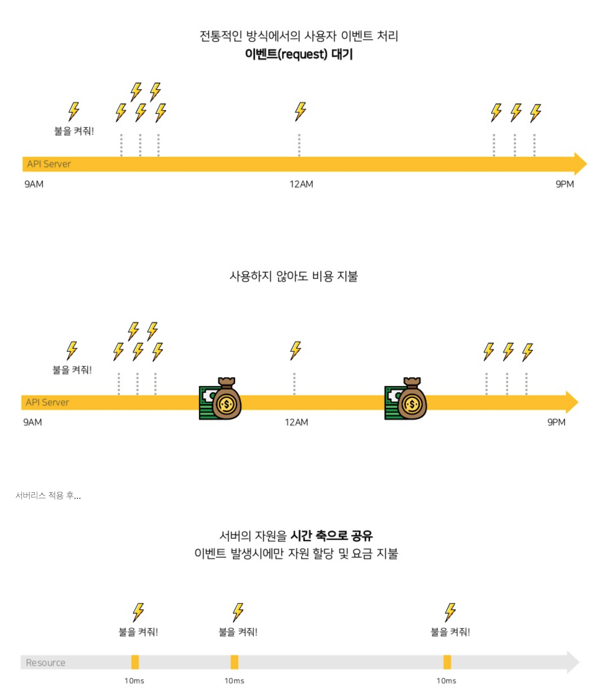

# 함수형 프로그래밍 기초

클로저나 하스켈같은 함수형 언어들의 어렵고 복잡한 개념, 문법 설명이 아닌 함수형 패러다임을 자바스크립트 코드로 배워보는 시간

## OOP 특징

- 객체지향 프로그래밍은 상태(데이터), 메소드(함수)로 구현.
- 5대원칙 : 단일책임, 개방폐쇄, 리스코브 치환, 인터페이스 분리, 의존성 역전
- 4개 특징 : 캡슐화, 상속, 추상화, 다형성
- 장점 : 재사용성, 유지보수
- 단점 : 처리시간, 설계시 많은 고민+시간

```javascript
// 객체 지향, print함수는 맴버변수의 상태에 따라서 값이 달라진다.
(() => {
  class Test {
    constructor(zero = 0) {
      this.zero = zero;
    }

    print(x) {
      console.log(`항상 x는 ${x}이고 zero는 ${this.zero}이여야 한다.`);
    }
  }

  const test = new Test(0);
  test.print(10); // zero 0
  test.zero = 10;
  test.print(10); // zero 10
})();
```

### FP

- 함수지향 프로그래밍은 상태 공유 X
- 함수를 call할 경우 타이밍과 순서는 결과를 변경하지 않는다.
- no side effect : 부수효과가 없다.
- pure function : 입력이 같으면 결과도 같다.( `f(x)=y`), 함수 내부에서 함수 외부에 값을 바꾸거나 임의의 타 객체를 생성하지 않는다.
- idempotency : 멱등성

```javascript
(() => {
  const name = "DJ";
  const hello = () => console.log(`I'm ${name}`);

  const pureHello = (name) => `I'm ${name}`;

  // non-pure function
  hello();

  // pure function
  console.log(pureHello(name));

  // 여기서 console이 내장 함수가 아니라 shopby.utils.xx 함수라면 결합도 차이는 어떻게 될까?
  // hello함수와 shopby.utils.xx는 항상 결합되어 있으며 만약 hello함수 내부에 여러개의 외부 함수가 있다면 복잡도(=결합도)는 최소 선형으로 증가. 근데 외부 함수 안에 다른 외부함수가 있다면? 제곱으로 증가..

  // pureHello를 살펴보면 외부와 단절되어있고 상태를 변경하지 않으며 그 자체로 immutable(불변)하며 여러곳에서 호출되더라도 리펙토링도 쉽고 결합도 역시 0이다.
})();
```

- Higher-order Function : 함수 자체를 파라미터(`예 : callback`)로 전달 또는 리턴이 함수자체, 대표적으로 map, filter, reduce, flatmap등등

```javascript
// 리턴이 함수일경우의 예
(() => {
  const add = (salary) => (name) => `${name}님 연봉 ${salary}만큼 올려주세요.`;
  const func = add(3000);

  // 결과 : xxx님 연봉 3000만큼 올려주세요.
  console.log(func("xxx"));
})();
```

- Non-iterable : for, while대신 high order function을 사용한다. (예 : map, reduce, flatmap, join등)
- immutable : 불변!

```javascript
(() => {
  const mutable = function () {
    const inputs = [`X`, `X`, `O`, `X`, `X`];

    // 명령형 (Imperative)
    for (let i = 0; i < inputs.length; i += 1) {
      if (inputs[i] === "O") {
        inputs[i] = `X`;
      }
    }

    return inputs;
  };

  console.log(mutable()); // 결과 [`X`, `X`, `X`, `X`, `X`]
})();
(() => {
  const immutable = function () {
    const inputs = [`X`, `X`, `O`, `X`, `X`];

    // 선언형 (Declarative)
    const newInputs = inputs.map((input) => (input === "O" ? "X" : input));

    return newInputs;
  };

  console.log(immutable()); // 결과 [`X`, `X`, `X`, `X`, `X`]
})();
```

```javascript
(() => {
  const products = [
    {
      productNo: 1,
      productName: "명품 삼겹살",
      options: [
        { optionNo: 11, optionName: "1키로", display: true },
        { optionNo: 12, optionName: "2키로", display: true },
      ],
    },
    {
      productNo: 2,
      productName: "명품 한우",
      options: [
        { optionNo: 21, optionName: "1키로", display: true },
        { optionNo: 22, optionName: "2키로", display: false },
        { optionNo: 23, optionName: "3키로", display: true },
      ],
    },
    {
      productNo: 3,
      productName: "명품 토종닭",
      options: [
        { optionNo: 31, optionName: "1키로", display: true },
        { optionNo: 32, optionName: "2키로", display: false },
      ],
    },
  ];

  // 화면에서는 옵션 단위로 노출, display는 true여야한다.
  // 예: 상품번호, 상품명, 옵션번호, 옵션명
  // Imperative
  const results = [];
  for (let p = 0; p < products.length; p += 1) {
    const product = products[p];

    for (let o = 0; o < product.options.length; o += 1) {
      const option = product.options[o];

      if (option.display) {
        results.push({
          productNo: product.productNo,
          productName: product.productName,
          optionNo: option.optionNo,
          optionName: option.optionName,
        });
      }
    }
  }

  console.log(results);

  // Declarative
  const results2 = products.flatMap((product) =>
    product.options
      .filter((option) => option.display)
      .map((option) => ({
        productNo: product.productNo,
        productName: product.productName,
        optionNo: option.optionNo,
        optionName: option.optionName,
      }))
  );

  console.log(results2);
})();
```


```javascript
// 또다른예
(() => {
  const x = [0, 5, 0, 1, 9, 1, 5, 6, 7, 2, 3, 1, 1, 1, 2, 0, 9, 2, 3, 4, 1, 9];
  // 0은 제거한후 홀수를 제거하고 2를 곱한 배열의 합을 구하시오.

const result = x
.filter(input => input !== 0) // 0이 아닌 결과를 반환
.filter(input => input % 2 === 0) // 짝수 반환
.map(input => input \* 2) // 2를 곱한 결과를 반환
.reduce((prev, cur) => prev + cur); // 전체 합을 구함

console.log(result);
})();

```

```javascript
// 명령형으로 만든 Shopby JS코드
const termsList = shopby.api.common.getTermsList({
  termsTypes: standardTermAgreements,
});
this.data.agreementList = Object.keys(termsList).map((termKey) => {
  if (termsList[termKey].used) {
    const key = termKey.toUpperCase();
    const [label, required] = termsTitle[key];
    return { ...termsList[termKey], label, required, key };
  }
});

//선언형
this.data.agreementList = shopby.api.common
  .getTermsList({ termsTypes: standardTermAgreements })
  .filter((term) => term.used)
  .map((term) => ({ ...term, label, required, key }));
```

- Persistent Data Structures : 상태 변화가 필요할때는 새로운 상태를 반환, 이전 상태는 유지

```javascript
(() => {
  const _closer = new Map();

  const persistent = (inputs) => {
    if (_closer.has(inputs)) {
      return _closer.get(inputs);
    }

    // 새로운 객체
    const result = inputs.map((input) => (input === "O" ? "X" : input));
    _closer.set(inputs, result);

    return result;
  };

  const inputs = [`X`, `X`, `O`, `X`, `X`];

  console.log(persistent(inputs) === persistent(inputs)); // true
})();
```

- currying : 함수에 인자를 하나씩 적용해 나가고 필요한 인자가 채워지면 함수를 실행

```javascript
(() => {
  const _curring = (fn) => (a) => (b) => fn(a, b);
  const substract = _curring((a, b) => a - b);

  console.log(substract(10)(5)); // 10 - 5 = 5
})();
```

즉 `인자를 함수로 받고`, 실행하는 즉시 `함수를 리턴한다.`

- closure : 함수가 속한 렉시컬 스코프를 기억하여 함수가 렉시컬 스코프 밖에서 실행될 때에도 이 스코프에 접근할 수 있게 하는 기능

```javascript
(() => {
  let say = "HI";

  const log = () => console.log(say);

  const log2 = () => {
    let say = "Hello";
    log();
  };

  log2(); // HI
})();
```

렉시컬 스코프 : `함수가 선언 될때 스코프 생성`

### Idempotent (멱등성)

같은 연산을 여러 번 적용해도 결과가 변하지 않는 성질

```javascript
// 배열 정규화 - 멱등성을 가짐
const normalizeArray = (arr) =>
  arr
    .filter((x) => x != null) // null, undefined 제거
    .map((x) => String(x).trim()) // 문자열로 변환 후 공백 제거
    .filter((x) => x !== "") // 빈 문자열 제거
    .map((x) => x.toLowerCase()) // 소문자 변환
    .sort(); // 정렬

const data = [null, "  Hello  ", "WORLD", "", undefined, "hello", "world"];

const result1 = normalizeArray(data);
console.log(result1); // ['hello', 'world']

const result2 = normalizeArray(result1);
console.log(result2); // ['hello', 'world'] (동일한 결과)

// f(f(x)) = f(x)
console.log(JSON.stringify(result1) === JSON.stringify(result2)); // true
```

## Serverless란?

aws lambda, cloud functions, azure functions등의 Function as a Service 상품을 이용하여 빠르게 기능을 구현, 배포, 관리

### 특징

- 개발자가 서버를 관리할 필요 없이 application을 빌드하고 실행할 수 있도록 하는 cloud native 개발 모델 : NoOps
- 서버가 없는게 아니라 존재 하지만 개발자가 신경쓸 필요가 없음
- 개발자는 코드를 작성하고 컨테이너에 패키징만 하면 끝
- 즉 오토스케일링 & 서버 프로비저닝, 배포, 모니터링등에 신경쓸 필요가 없음 (Automatic Scaling, Built-in Fault tolerance)
- 배포 후에는 어딘가에 내가 작성한 코드가 올라가고 이벤트 기반으로 실행되며 실행한 만큼 미터링됨
- iaas상품보다 가격이 매우 저렴



### FaaS

- Function as a Service
- stateless 컨테이너에서 실행되는 이벤트 기반 컴퓨팅 실행 모델
- serverless computing 구현하는 방식. 개발자는 비지니스 로직에 집중, faas가 컨테이너에서 실행
- 서버리스 패러다임이 인기 (serverless micro services, serverless container)


#### 개발 시나리오

1. 개발자는 function을 작성한다.
2. function을 faas에 올린다. (git push한다)
3. 트리거에 의하여 function이 실행된다.

### 장점

- Productivity, Stability, reliability, scalability, flexibility, Cost Effective
- 모든 프로그래밍 언어로 작성가능(polyglot) : 컨테이너를 올리는 개념이라 극단적으로 표준 입력, 출력으로도 가능함
- kafka consumer와 같이 이벤트가 발생되면 구독하고 있는 서비스로 메세지를 push
- 이벤트 스펙은 cloudevent(CNCF에서 정의)


### 단점

- cold start : JVM의 높은 시작 지연으로 인하여 graalVM와 같은 네이티브 기술이 발전 -> Provisioned Concurrency
  
- 각 함수에서 사용할수 있는 자원이 제한됨
- stateless : 전역변수 개념 X
- 응답이 길거나 예외사항이 많을경우 제약
- 프론트에서 해야할 일을 백엔드에서 처리하려고 함
- serverless vendor lock-in


## 의견

- 기존 프로그래밍의 패러다임을 바꾸자 -> 함수형, 선언적, 비동기, 이벤트 드리븐
- 기존 아키텍처의 패러다임을 바꾸자 -> cloud native

### 참고

- https://hyojabal.tistory.com/41
- https://github.com/awskrug/serverless-group
